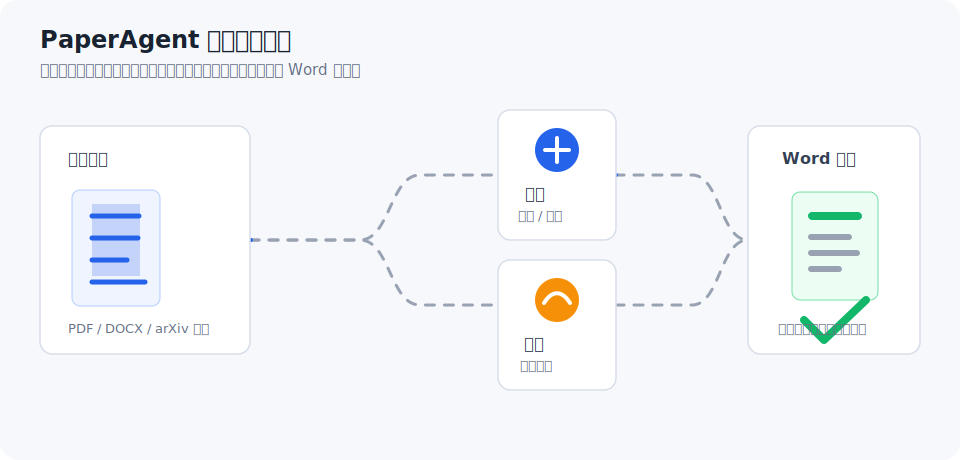
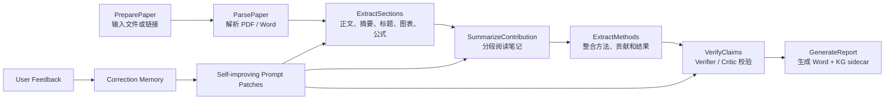
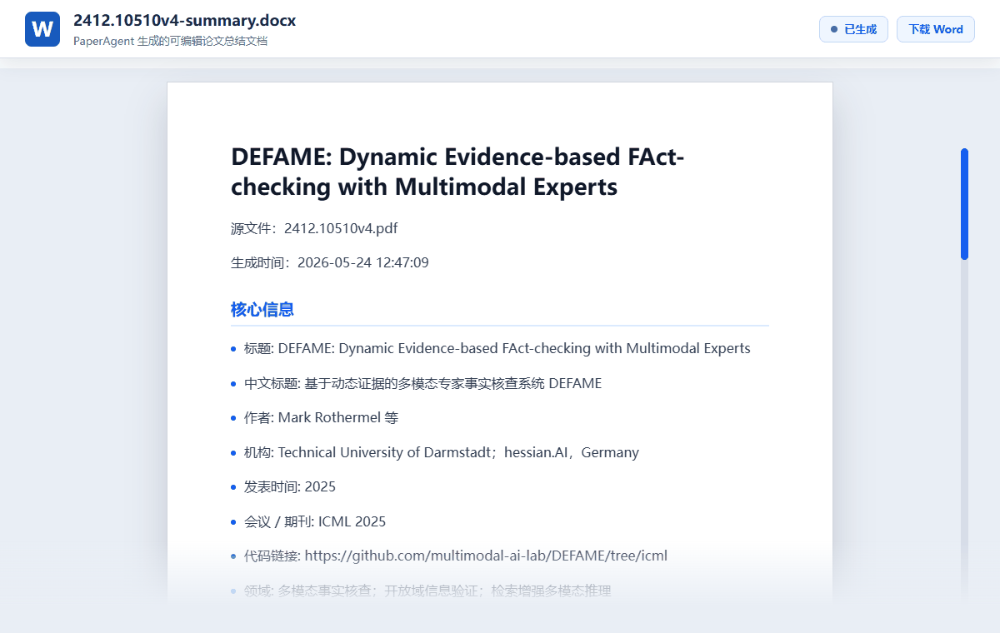

# PaperAgent

**Grounded Paper Reading Agent Harness：让论文总结从一次性生成，变成可追踪、可验证、可迭代的 Agent 工作流。**

PaperAgent 是一个面向科研论文理解的本地 Agent Harness。它把论文解析、证据抽取、图表/公式定位、结构化总结、Claim Verifier、Word 报告生成和用户反馈学习组织成一条可观测、可验证、可迭代的工作流。

它不是简单的“PDF 丢给大模型做摘要”，而是通过 Reader、Extractor、Synthesizer、Verifier 等角色，以及 Grounding Map、Asset Manifest、Correction Memory、Prompt Patch 和 Agent Trace 等工程组件，尽量保证每个关键结论都能回到原文证据，每次用户修正都能反哺后续总结。

<p align="center">
  
</p>

## 项目定位

PaperAgent 关注的不只是“生成一份好看的论文总结”，而是构建一个面向研究文档理解的 Agent Harness：

- **Agent Harness**：把 Reader、Extractor、Synthesizer、Critic 等角色放进同一条可执行工作流里，明确输入、输出、依赖关系和失败条件。
- **Harness Engineering**：围绕 PDF 解析、图表截图、Grounding Map、Knowledge Graph、Verifier Agent、报告生成等环节做工程约束，减少幻觉和错配。
- **Loop Engineering**：把用户反馈写入 correction memory，再自动生成 extraction prompt、summarization prompt 和 evaluation rubric 的 prompt patch，让系统在真实使用中持续修正。

## Agent Harness 架构

PaperAgent 当前的论文总结链路被组织为 DAG / graph executor，而不是单次 prompt 调用：



这条链路让 Agent 的行为更像一个可观测的实验系统：Reader 负责读入和解析，Extractor 负责结构化证据，Synthesizer 负责写作，Critic 负责拒绝没有证据支持的 claim，最后由报告生成器把文本、图表和元信息写入 `.docx`。

## 代码结构

项目目录已经按 Agent Harness 的工程边界组织。当前 `paper_summary.py` 仍保留为兼容核心，新的包结构作为稳定 facade 承接后续拆分：

```text
paper_agent/
  app/          # CLI、GUI、backend、MCP 等应用入口 facade
  harness/      # DAG workflow、node、context、trace、policy、result
  agents/       # Reader、Extractor、Synthesizer、Verifier、Reflector
  tools/        # PDF 解析、资产抽取、公式、DOCX、KG、Grounding
  memory/       # correction memory 与 self-improving prompt patch
  evaluation/   # verifier validators、metrics、golden cases
  schemas/      # paper、asset、claim、report 等共享 schema
```

这一步的目标是先把调用边界稳定下来：GUI 和 backend 通过 `harness/`、`memory/` 入口调用总结能力，测试也覆盖新 facade。后续可以把 `paper_summary.py` 中的实现按这些边界逐块迁移，而不影响外部入口。

Harness 层的节点协议已经开始结构化：每个节点声明 `requires` / `produces`，执行后写入 `NodeResult`，包含 `status`、`outputs`、`evidence`、`artifacts`、`errors`、`warnings` 和 `metrics`。这让 ParsePaper、ExtractEvidence、SynthesizeReport、VerifyClaims、GenerateDocx 这类节点都可以被检查、统计和回放。

Agent 也从简单 role enum 升级为 Agent Contract：

- `ReaderAgent`：读取 PDF / Word / link，输出 `PaperSource`、`PageBlock`、`RawText`、`RawAsset`，这是纯规则/工具节点，不要求 LLM。
- `ExtractorAgent`：抽取 section、caption、formula、asset，输出 `EvidenceMap`、`AssetManifest`、`FormulaList`、`KnowledgeGraph`，优先由规则和解析工具完成。
- `SynthesizerAgent`：生成结构化精读笔记，输出 `DraftReport` 和 `ClaimList`，这是 LLM 节点。
- `VerifierAgent`：检查 claim grounding、asset 引用和格式，输出 `VerificationReport` 和 `FixedReport`，可结合 LLM 与规则校验。
- `ReflectorAgent`：从用户反馈生成 `CorrectionMemory`、`PromptPatch` 和 `RubricPatch`，服务 Loop Engineering。

每次论文处理都会产出一组可审计文件：

- `*-summary.docx`：最终 Word 精读报告。
- `*-trace.json`：每个节点的 `run_id`、agent contract、input/output keys、status、errors、warnings、metrics 和 artifacts。
- `*-grounding-map.json`：章节、证据和 claim grounding 结构。
- `*-verification.json`：Verifier Agent 的通过状态和错误列表。
- `*-knowledge-graph.json`：论文概念、方法、数据集、评估节点及其关系。

Harness 还内置一组 Guard，用来把常见失败模式变成可检查结果：

| Guard | 解决什么问题 | 实现方式 |
| --- | --- | --- |
| Evidence Guard | 总结幻觉、无证据 claim | claim 必须映射到 section / abstract / figure caption |
| Asset Guard | 图表引用错、表图混用 | `[[ASSET:id]]` 必须来自 asset manifest，kind 必须匹配 |
| Coverage Guard | 漏掉方法/实验/局限 | 检查摘要、方法、实验、局限是否有覆盖 |
| Format Guard | Word 生成失败、Markdown 格式乱 | 检查标题层级、占位符、空章节 |
| Citation Guard | DOI、年份、机构乱编 | 核心元信息必须来自原文 front matter |
| Loop Guard | 反复修不收敛 | 最多修复 N 次，保留失败原因 |
| Memory Guard | 错误反馈污染全局规则 | memory 分 paper-level / global-level，带 category 和 confidence |

Verifier Agent 也升级为明确的门禁策略，而不是只返回一串 critic 文本。它要求结构化 JSON：

```json
{
  "passed": false,
  "hard_failures": [
    {
      "type": "unsupported_core_claim",
      "claim": "论文提出了新的数据集 XXX",
      "reason": "grounding map 中没有数据集 XXX"
    }
  ],
  "soft_warnings": [
    {
      "type": "weak_evidence",
      "claim": "方法有较强泛化能力",
      "reason": "原文只有单数据集实验"
    }
  ],
  "patch_suggestions": [
    {
      "operation": "delete_claim",
      "target": "论文提出了新的数据集 XXX"
    }
  ]
}
```

门禁策略是：

- `hard_failures > 0`：停止 `GenerateDocx`，不生成 Word，并写出 verifier 报告。
- `soft_warnings > 0`：允许生成 Word，但写入 `trace.json` 和 `verification.json`，用于后续审计。
- `patch_suggestions > 0`：先进入一次 revision loop，尝试删除或替换无证据 claim，再重新运行 Verifier。

## 网页端效果

启动后访问 `http://localhost:7860/`，可以从文件或链接输入论文，等待解析和总结完成后，在页面上看到 Word 总结效果，并下载生成的 `.docx` 文件。

<p align="center">
  
</p>

## 最终输出效果

生成完成后，页面会展示 Word 总结文档的预览效果，并提供 `.docx` 文件下载。最终文档不是只给一段简单摘要，而是会整理成便于阅读和二次编辑的结构化内容，例如：

<p align="center">
  
</p>

```text
论文标题：Visual Language Model Survey

一句话总结：
本文系统梳理了视觉语言模型的发展脉络、主流架构、训练方法和典型应用场景。

核心贡献：
1. 总结视觉编码器、语言模型和跨模态对齐模块的常见组合方式。
2. 对比不同数据构建、指令微调和评测方法的优缺点。
3. 归纳模型在文档理解、图像问答、多模态推理等任务中的应用价值。

方法概览：
- 输入：图像、论文截图、表格或多模态上下文。
- 处理：视觉特征提取 -> 跨模态对齐 -> 大模型生成解释。
- 输出：文本回答、结构化摘要、推理过程或可编辑文档。

关键图表：
- 自动保留论文中的重要图表截图。
- 在图表下方补充中文解释，帮助快速理解实验结论。

阅读建议：
适合先阅读摘要、方法概览和关键图表，再根据总结定位原文中的重点章节。
```

当前总结文档通常包含：

- 论文基本信息：标题、来源文件、处理时间等。
- 背景与问题：给不熟悉领域的读者解释研究背景、任务动机、已有方法不足和本文要解决的问题。
- 一句话总结：快速说明论文主要研究什么、解决什么问题。
- 核心贡献：提炼论文的主要创新点和价值。
- 方法与流程：用中文解释模型、算法或实验流程。
- 关键图表说明：保留重要图表，并生成对应中文解读。
- 实验结果与结论：整理主要实验发现、对比结果和作者结论。
- 阅读建议：帮助读者判断优先阅读哪些章节。

## 功能特点

- 支持上传本地 PDF、DOC、DOCX，也支持输入论文链接。
- 自动抽取论文正文、版面结构、图表截图、表格、公式和摘要证据。
- 使用 DAG / graph executor 组织论文理解流程，节点包括 ParsePaper、ExtractSections、SummarizeContribution、ExtractMethods、VerifyClaims 和 GenerateReport。
- 内置多 Agent 分工：Reader 读论文，Extractor 抽取结构，Synthesizer 写总结，Critic / Verifier 检查可信度。
- 构建 Grounding Map，把 intro、method、experiments 和 claims 映射回原文证据。
- 构建 Paper-to-Knowledge Graph，提取 concept、method、dataset、evaluation 等节点和关系。
- Verifier Agent 会检查 claim 是否能在原文中找到支撑，方法类 claim 是否落在 method 证据中，贡献类 claim 是否新增了原文没有的内容。
- 支持 correction memory：用户反馈会被保存为历史修正规则，后续总结自动注入。
- 支持 self-improving prompt patches：根据历史反馈自动优化 extraction prompt、summarization prompt 和 evaluation rubric。
- 在浏览器中预览论文，并下载生成的 `.docx` 总结文档。
- 直接使用 Python 命令行启动。

## Harness Engineering

PaperAgent 的重点不是把 prompt 写得更长，而是把论文理解过程放进可控的 Harness：

- **结构化执行**：每个 workflow node 都有明确依赖，失败可以定位到具体阶段。
- **证据优先**：标题、摘要、公式、图表和 claim 都尽量保留原文来源，避免把模型常识写进报告。
- **资产约束**：图表引用必须来自已抽取的可用截图，正文不能凭空编造图号、表号或公式号。
- **评估闭环**：Verifier Agent 在生成报告前检查关键 claim，失败时停止生成，而不是把不可信内容写进 Word。
- **可观察产物**：除了 `.docx` 报告，还会生成 trace、grounding map、verification 和 knowledge graph sidecar，用于查看 Agent trace、结构节点和证据关系。

## Loop Engineering

PaperAgent 也把“用户指出错误”视为系统输入，而不是一次性对话里的临时修正：

```text
user feedback
  -> summary correction
  -> correction memory
  -> prompt patch
  -> future extraction / summarization / evaluation
```

反馈可以通过后端接口写入：

```http
POST /v1/summary_feedback
```

示例 payload：

```json
{
  "paper_id": "Linear Image Generation by Synthesizing Exposure Brackets",
  "category": "asset_reference",
  "original": "文字写着表2所示，但插入的是图",
  "corrected": "图表引用必须和原文 caption 类型一致",
  "note": "没有表格 caption 的截图不能被当成表格编号引用"
}
```

系统会把这些修正保存到 correction memory，并在下一次处理同一论文或全局规则时自动生成三类 prompt patch：

- `extraction`：影响标题、摘要、章节、图表、公式等证据抽取。
- `summarization`：影响最终中文精读报告的组织、措辞和引用方式。
- `evaluation`：影响 Verifier Agent 的检查标准和拒绝条件。

当前自动生成的 prompt patch 可以通过接口查看：

```http
GET /v1/prompt_patches?paper_id=your-paper-id
```

默认记忆文件位置：

```text
~/.config/PaperAgent/summary_corrections.jsonl
```

也可以通过 `PAPER_AGENT_CORRECTION_MEMORY_PATH` 指定自定义路径。

## 处理流程

程序启动后会读取配置文件中的模型接口参数。用户提交论文后，PaperAgent 会先解析 PDF 或 Word 文档，提取正文、版面结构和关键素材；随后构建 Grounding Map 和 Knowledge Graph；再把论文正文分块发送给大模型生成分段笔记，由 Synthesizer 合并、润色和结构化整理；最后由 Verifier Agent 校验关键 claim，通过后把总结内容与关键图表写入 Word 文档。

整体流程：

```text
论文文件或链接
  -> 文档解析与正文抽取
  -> 图表 / 表格 / 公式素材提取
  -> Grounding Map + Knowledge Graph
  -> Reader / Extractor / Synthesizer 多 Agent 协作
  -> Verifier Agent 校验 claim
  -> 生成 Word 总结文档与 KG sidecar
```

## 环境要求

- Python 3.11 或 3.12
- 已安装项目依赖
- 一个兼容 OpenAI SDK 的接口地址、API Key 和模型名称

## 安装依赖

建议在项目目录下创建虚拟环境：

```powershell
python -m venv .venv
.\.venv\Scripts\activate
python -m pip install -U pip
pip install -e .
```

也可以直接使用当前系统 Python：

```powershell
pip install -e .
```

## 配置说明

仓库中的 [config.json](./config.json) 是提交用模板，敏感字段已经脱敏：

```json
{
    "CODEX_BASE_URL": "xx",
    "CODEX_API_KEY": "xx",
    "CODEX_MODEL": "xx"
}
```

本地使用时，请复制一份私有配置：

```powershell
copy config.json config.local.json
```

然后编辑 `config.local.json`：

```json
{
    "CODEX_BASE_URL": "https://你的接口地址/v1",
    "CODEX_API_KEY": "你的 API Key",
    "CODEX_MODEL": "你的模型名称",
    "CODEX_USE_PROXY": false,
    "ENABLED_SERVICES": [],
    "HIDDEN_GRADIO_DETAILS": true,
    "PAPER_AGENT_LANG_FROM": "English",
    "PAPER_AGENT_LANG_TO": "Simplified Chinese",
    "PAPER_AGENT_VFONT": null,
    "NOTO_FONT_PATH": "/app/SourceHanSerifCN-Regular.ttf",
    "PAPER_AGENT_CORRECTION_MEMORY_PATH": "",
    "PAPER_AGENT_PROMPT": ""
}
```

`CODEX_USE_PROXY` 默认为 `false`，总结接口不会继承系统 `HTTP_PROXY` / `HTTPS_PROXY`。如果你的接口必须走代理，再改成 `true`。

`config.local.json` 已加入 `.gitignore`，不会提交到 GitHub。你当前机器上的真实配置保存在该文件中，本地启动时直接指定它即可。

## 启动命令

在项目根目录执行：

```powershell
python -m paper_agent -i --config config.local.json
```

浏览器打开：

```text
http://localhost:7860/
```

如果要直接使用 `config.json`，请先把其中的 `xx` 改成真实值：

```powershell
python -m paper_agent -i --config config.json
```

## 命令行示例

启动图形界面：

```powershell
python -m paper_agent -i --config config.local.json
```

指定端口启动：

```powershell
python -m paper_agent -i --serverport 7860 --config config.local.json
```

查看版本：

```powershell
python -m paper_agent --version
```

翻译论文：

```powershell
python -m paper_agent example.pdf -s openai --config config.local.json
```

## 提交前检查

提交到 GitHub 前建议确认没有泄露真实密钥：

```powershell
rg -n "sk-[A-Za-z0-9]{20,}" --hidden --glob "!.git/**" --glob "!config.local.json"
```

预期结果应为空，不能出现真实 URL 或真实 Key。

## 致谢

感谢 [guaguastandup/zotero-pdf2zh](https://github.com/guaguastandup/zotero-pdf2zh) 项目提供的启发与参考。

本项目也基于开源社区中大量优秀 PDF 解析、版面分析、文档生成和 Gradio 组件能力构建，在此一并致谢。
